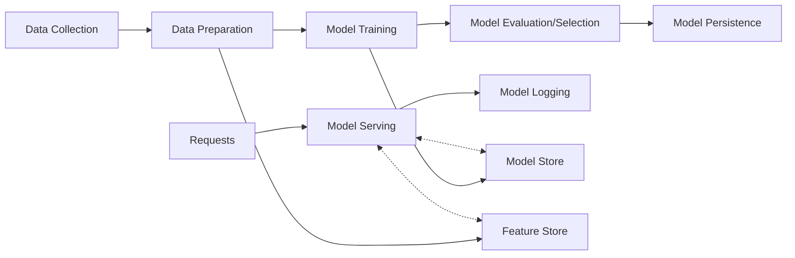

```mermaid
graph LR;

a[Data Collection] -->b[Data Preparation] --> c[Model Training] --> d[Model Evaluation/Selection] --> e[Model Persistence]
req[Requests]-->ms[Model Serving]
ms-->ml[Model Logging]
ms<-.->g
ms<-.->f


b-->f[Feature Store]
c-->g[Model Store]
```

# Data Science Process Diagram
