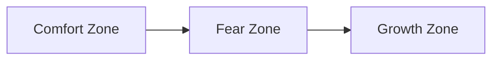

Related to embracing failure, and not being afraid of it.

(should be a concentric circles)

```mermaid

graph LR;
A[Comfort Zone]-->B[Fear Zone]-->C[Growth Zone];
```

By definition anything that's not in the 'fear zone' is in the 'comfort zone'