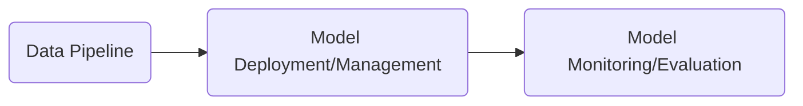

from 

Real world ML systems:

Real world ML systems:
10% algorithms
90% ml systems

How to return the focus to the algorithms:
# ML Systems
Robust tools + templatzize best practices

## DoorDash overview
* Last mile on-demand logistics
* 3 sided marketplace (users, restaurants, delivery service)
* 1600 cities by end of 2018

Technology company
Connecting the 3-sided marketplace.
Mostly restaurant delivery.

100000+ resraurants.
300000 delivery drivers.
10^10^6 deliveries.
### Goals of users:

### Restaurants:
reach and revenie

### Delivery Service:
Flexibility and earnings

### Users:
Convenience and seleciton

Between the above sides, there are multiple ml algorithms:

## Users-Restaurants:
Recyss- recommendation/personalization, search ranking, demand prediction.

## Merchants - Drivers:

Core dispatch algorithm
Hotspots
Batching of orders/etc

Seems like the usual VRP stuff...

# Merchants:

food prep time
parking prediction
selection intelligence (e.g. what things are ppl going to order, how to structure the menu maybe, etc..)
combine demand spikes etc

# Users
lifetime value
promotions
aquisition

# Delivery Service

Supply calculation 
Pay calculation (effort-based)
Incentives

# Offline (batch) to online (on-demand) axis

reccomendation might be offline (in this case) so offline
time prediction -online
demand forecasting in the middle (multiple horizons).

