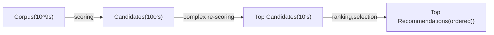

# Why Recsys?

Item space, user space.
Very high value to customer and commercial.
Items can be other users too, i.e. tinder.

# References
[Matrix Factorization Report](https://pdfs.semanticscholar.org/b474/56864177f79b0ef1b00ac923527aac256ffc.pdf).

# Requirements
## Functional
 Enjoyable content
 Increasing Revenue
 Fairness (across demographic strata)
 Fairness (across items)
 Diversity of content (serendipity)

## Non-functional
* Availability
* Low latency

# System Overview

## Scalability Concern 1

# Data

## User features:

login date, demographics

## Item features

Item content features- description, publisher, category, images, video snapshots. Tags, publisher tags,
tags from image/video object detection algos, etc.

# Item-user Interaction 
* Rating
* Purchase
* Other stuff

# Feature Engineering
* Normalization of ratings

## Implicit and Explicit Signals, combining them ^implicit-explicit signal

Summary:
implicit feedback based models seem better for ranking predictions, much richer, but if
basing only on implicit feedback, might have popularity bias.
![[science.stats.Regression.Recommender Systems#^popularity-bias-implicit]]

# Metrics
* 
![[science.stats.Regression.Metrics#^ranking-start:^ranking-end]]
![[science.stats.Regression.Metrics#^ranking-start:#^ranking-end]]

# Item-item or user-user based similarity (content-based filtering) ^content-filtering
## Data:
Movie profile:
* Genre
* Producer
* Tags
* Description (word2vec,doc2vec)
* Images and video snapshots (maybe tagging based on that, maybe color pallet)
* Thumbnails
<!-- * User search/interest history -->

Maybe latent space of 'interests' that's common to not only this recsys, but
the search as well...

# Item-user based similarity (collaborative filtering) ^collaborative-filtering

# Models ^models
## Item-Item Similarity

* Item KNN
* Item Attr
* BPRMF
* ItemKNN
* Item Attribute KNN
* UserKNN
* User Attribute KNN
* Group-based (Clustering-based algorithm)
* Paco Recommender (Co-Clustering-based algorithm)

## Item-User Embedding (Collaborative Filtering))
* Matrix Factorization (with and without baseline)
* Non-negative Matrix Factorization
* SVD
* SVD++
* ItemKNN

# Algorithms ^algorithms

For content filtering approaches:

Clustering type things, manifold dimensionality reduction, etc. General unsupervised learning techniques.
[[science.stats.Unsupervised Learning]] 
[[science.stats.Unsupervised Learning.KNN]] 

## Collaborative Filtering
### Stochastic Gradient Descent ^sgd
[[science.math.Optimization.Stochastic Gradient Descent]]

### Alternating Least Squares ^als

Note in ![[science.stats.Regression.Recommender Systems#^svd-loss2]] 
we're optimizing wrt $p,q,b$. 
The loss is not convex, BUT if we fix $p,b$ we can optimize wrt $q$ with least squares.
Same for fixing $q,b$ -$p$ and $q,p$, which means we can have a sequence of solving quadratic (and I think in this case, convext) problems.

 Advantages:
 massive parallelization, as if we have only the $p,q$ case, the objective function decomposes across variables!!!
 But depends on the objective itself.

# Cold Start Problem

## New Item
* Use item-item model, based on content:

## New User

### User-user model, based on demographic characteristics

###  Anonimous Users
 
 If no profile, start showing items (Akinator-style)[https://en.akinator.com/] somehow and try to represent the user a s linear combination of the items seen.

### Intra-session models

## Representing user as linear combination of items

# Discrepency between 'business goal metric' and 'within-optimizer loss'

Can have variety of final allocators.

# Fairness ^fairness
[[Philosophy and Rationality.Algorithmic Fairness]]
## Error is same across groups

![[Philosophy and Rationality.Algorithmic Fairness#^independence-formula]]

Can either model directly or just train algo and then test if erros same (ANOVA, t-test variations etc).

# Keeping Track and serving of multiple models, model versions, A/B/C/D... testing,rollbacks
## Data Structure for multiple models

## A/B/C/D testing 

## Model Rollback

## Train-test set splitting

Probably similar to how we split data for testing in [[science.stats.Deep Neural Networks.Graph Neural Networks]]

[[stats.Train Test Splitting]]

# Moderation

Remove, reduce, inform approach.

## Remove

As users upload stuff, it's put in a [[engineering.technologies.Message Queues]] and pool of workers
is processing it for violation of Community standards, forbidden content, abuse, etc.
If confidence is high >99.5%, say, can directly remove.

## Reduce

Can send stuff above certain threshold for manual moderation. Can have buttons to report, etc,
gain more feedback about it.
 Threats, etc.

## Inform

Can match clickbait titles, if we detect topic or semantics of a title/article, can check agains 
3rd party fact-checkers.