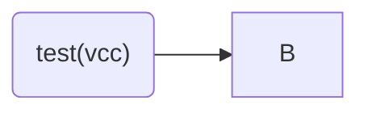

# Why Recsys?

Item space, user space.
Very high value to customer and commercial.
Items can be other users too, i.e. tinder.

# Requirements
## Functional
 Enjoyable content
 Increasing Revenue
 Fairness (across demographic strata)
 Fairness (across items)
 Diversity of content (serendipity)

## Non-functional
* Availability
* Low latency


# System Overview

## Scalability Concern 1

```mermaid

graph LR;

a[("Corpus(10^9s)")]--"candidate generation(offline, maybe items only)"-->b[("Candidates(10^2s)")]--"scoring(mor complex algos)"-->[(Top Candidates)[10^2s]]--"re/ranking/optimization"-->c[("Top Recommendations in order")];
```


# Data

## User features:

login date, demographics

## Item features

Item content features- description, publisher, category, images, video snapshots.

# Item-user Interaction 
* Rating
* Purchase
* Other stuff


# Feature Engineerin
* Normalization of ratings


## Implicit and Explicit Signals, combining them


# Metrics
* Targiting


# Item-item based similarity (content-based filtering)

# Item-user based similarity

# Algorithms:
## Item-Item Similarity


## Item-User Embedding (Collaborative Filtering))


# Cold Start Problem

## New Item

* Use item-item model, based on content

## New User

### User-user model, based on demographic characteristics

###  Anonimous Users

### Intra-session models

## Representing user as linear combination of items

# Discrepency between 'business goal metric' and 'within-optimizer loss'

Can have variety of final allocators.

# Fairness
## Error is same across groups
Can just train algo and then test if erros same (ANOVA, t-test variations etc)


# Keeping Track and serving of multiple models, model versions, A/B/C/D... testing,rollbacks
## Data Structure for multiple models

## A/B/C/D testing 

## Model Rollback


