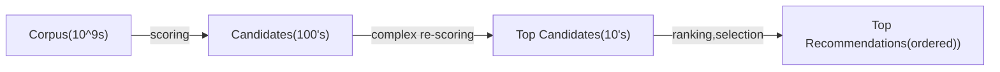

# Why Recsys?

Item space, user space.
Very high value to customer and commercial.
Items can be other users too, i.e. tinder.

# References
[Matrix Factorization Report](https://pdfs.semanticscholar.org/b474/56864177f79b0ef1b00ac923527aac256ffc.pdf).

# Requirements
## Functional
 Enjoyable content
 Increasing Revenue
 Fairness (across demographic strata)
 Fairness (across items)
 Diversity of content (serendipity)

## Non-functional
* Availability
* Low latency

# System Overview

## Scalability Concern 1

# Data

## User features:

login date, demographics

## Item features

Item content features- description, publisher, category, images, video snapshots.

# Item-user Interaction 
* Rating
* Purchase
* Other stuff

# Feature Engineering
* Normalization of ratings

## Implicit and Explicit Signals, combining them ^implicit-explicit signal

# Metrics
* 

# Item-item or user-user based similarity (content-based filtering) ^content-filtering
## Data:
Movie profile:
* Genre
* Producer
* Tags
* Description (word2vec,doc2vec)
* Images and video snapshots (maybe tagging based on that, maybe color pallet)
* Thumbnails
<!-- * User search/interest history -->

Maybe latent space of 'interests' that's common to not only this recsys, but
the search as well...

# Item-user based similarity (collaborative filtering) ^collaborative-filtering

# Algorithms:
## Item-Item Similarity

* Item KNN
* Item Attr
* BPRMF
* ItemKNN
* Item Attribute KNN
* UserKNN
* User Attribute KNN
* Group-based (Clustering-based algorithm)
* Paco Recommender (Co-Clustering-based algorithm)

## Item-User Embedding (Collaborative Filtering))
* Matrix Factorization (with and without baseline)
* Non-negative Matrix Factorization
* SVD
* SVD++
* ItemKNN

# Cold Start Problem

## New Item

* Use item-item model, based on content

## New User

### User-user model, based on demographic characteristics

###  Anonimous Users

### Intra-session models

## Representing user as linear combination of items

# Discrepency between 'business goal metric' and 'within-optimizer loss'

Can have variety of final allocators.

# Fairness ^fairness
## Error is same across groups
Can just train algo and then test if erros same (ANOVA, t-test variations etc)
[[Philosophy and Rationality.Algorithmic Fairness]]

# Keeping Track and serving of multiple models, model versions, A/B/C/D... testing,rollbacks
## Data Structure for multiple models

## A/B/C/D testing 

## Model Rollback

## Train-test set splitting

Probably similar to how we split data for testing in [[science.stats.Deep Neural Networks.Graph Neural Networks]]