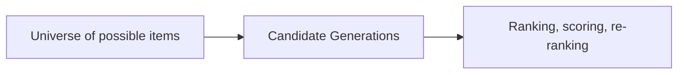

# ML System Design Interview Structure

Signals they're looking for
* Theoretical knowledge of ML
* Methods/ algorithms 
* How it's done in the industry/ state of the art solutions
* Practical Experience 
* Implementation: development and model serving 
* Technical leadership
* Product leadership: 

 

 People ask about recommendation systems, as it:
 1. Huge impact/ big part.
 2. Many approaches, very creative methods, could go in different directions.
 3. Non-trivial model serving.
 4. Tricky product stuff.

Examples:
 1. Recommend new trips to take.
 2. Recomend restaurants on Google Maps.

# Design Process

# Clarify Objectives And Constraints (requirements)

1. What are we optimizing?
 Engagement+ revenue are common ones.
2. Timing SLA (batch or real-time)?
3. Scale (whole product/all users, is it decomposeable,etc)?
4. Multiple languages? 
5. Recency of content to show?

__Look for buy in...__

# User Feed/recommendations

# Inputs and Features

Sources:
* User profile
* Item profiles (e.g. videos)
 * User-item interactions.
 * The search query

Features:
* Session information (length, number of viewed items)
* Item profiles (e.g. videos): NumViews, weighted number of views, description, features from the video, text, data2vec, etc
* User demographics info - age, gender, nationality, location
* Post History/ action history
* Friends and following -  info from the graph

