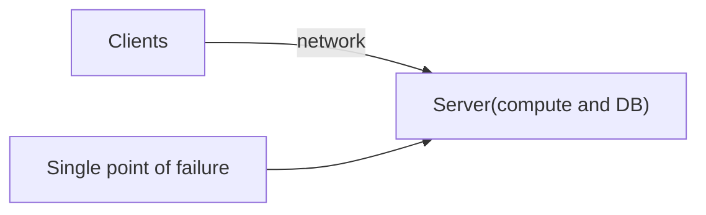
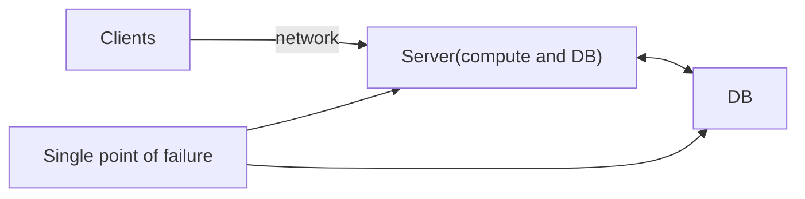
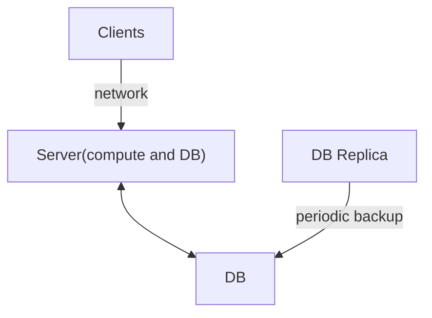
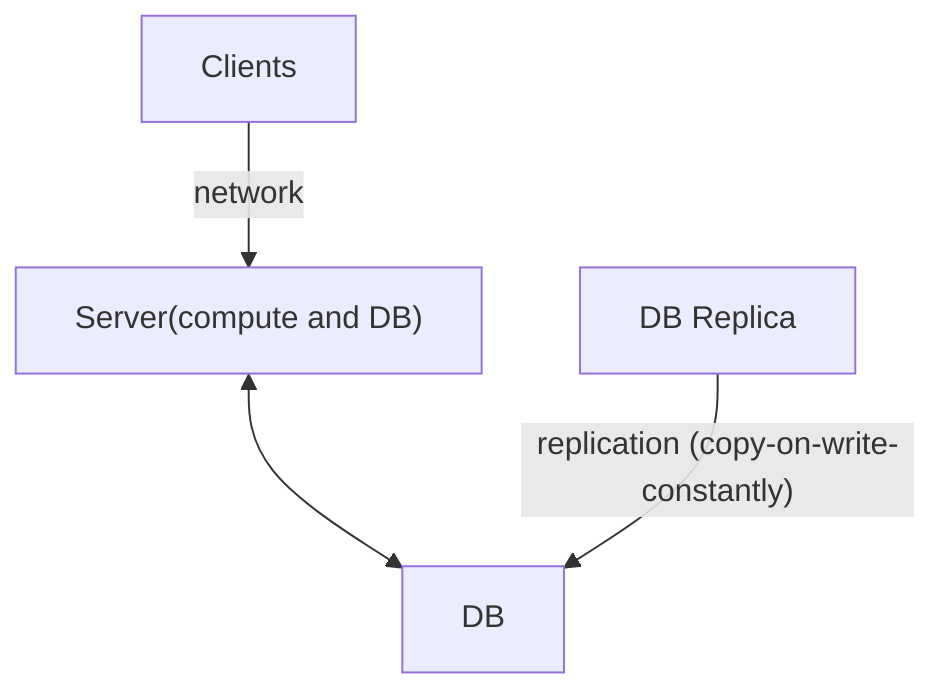
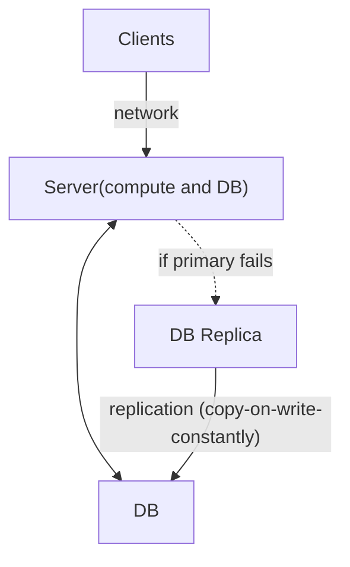
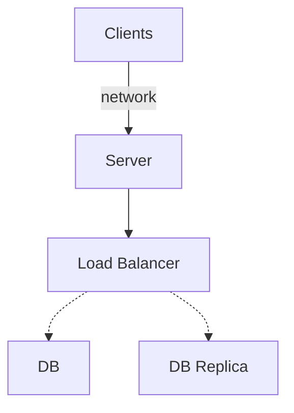

Notes and references here:

[log based workflow](
https://onedrive.live.com/redir?resid=A6A13EED7FFACAB8%212256&page=Edit&wd=target%28Quick%20Notes.one%7Cb7e7d858-e5f0-4801-9d21-c506078b696a%2FSystem%20design%20and%20logs%7C468f4191-cdbc-7440-b035-e8581ff8b933%2F%29)

https://onedrive.live.com/redir?resid=A6A13EED7FFACAB8%212256&page=Edit&wd=target%28Transmetrics%20Clieant%20Projects%2FNew%20Section%208.one%7Cc346bbda-ef84-4637-8db7-5b2328e31011%2FManage%20massive%20writes%20with%20HA%5C%2FDR.%20-%20A%20%7C65627e1e-3a4b-4e06-a3df-7d4a7968a69f%2F%29

# Basics

## Single- Server Design 

 Single point of failure is bad

not any better

Vertical Scaling - buy bigger server, has limits.

Horizontal Scaling - buy more servers, larger limits.

Geo-disitrubtion of servers.

 *Any individual server cannot assume that that server is the same one that served previous requests to a given user. That's what I mean by stateless.*

Different Data centers (availability zones in AWS).

# DB Replication

## Cold Standby 

Downtime; backup files to restore with, data since last backup is lost.

## Warm Standby

Most Database systems have their own replication mechanisms.
__Replication__ is a process of copying data from one database to another. For most practical cases, 
it's just a switch you turn on...

##  Hot Standby

## horizontal 

