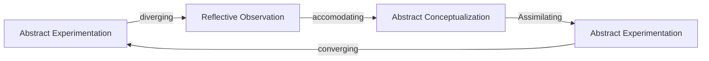

# Hierarchy Of Competence

## Unconscious Incompetence
Wrong Intuition- don't know what you don't know

## Conscious Incompetence

You're doing some wrong analysis and can understand why you're wrong.

## Conscious Competence

Can do the right analysis

## Unconscious Competence

Right intuition...

