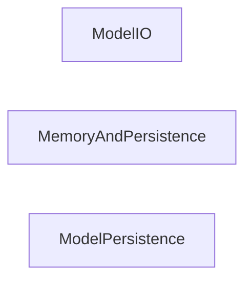

LangChain allows to chain models into different things, giving programmability..

Basic example- one component decides what language you're speaking, then the next models are the ones you call..

Some python funcitons to extract structured data from your models...

There can be agents that are being called into one another, performing various functions, talking to each other...

Vector db's and embeddings....

built image-to-text using blip...

----

Active recall was not too successful there...

# Notes from the documentation

main value propositions- compionents, and then pre-build chains

components are more interesting.

there is also js, and a hack thing...

