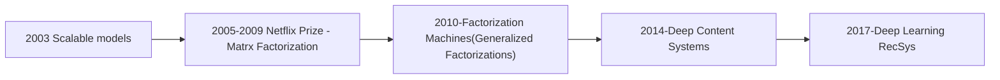

[Rec Systems Google Drive](https://drive.google.com/open?id=0B-C_0LZtyGcNR3RMTlFVVGRKWEE&resourcekey=0-zkpm-R4LmO8XCchjdcEMHA&authuser=stefanvpetrov%40gmail.com&usp=drive_fs).

[Netflix Prize Paper On Matrix Factorications]()
[[science.math.Linear Algebra]]

[Netflix Prize Paper](https://drive.google.com/open?id=1AqarZQOZgrcYehme3JzL4pCV_IAQhn_E&authuser=stefanvpetrov%40gmail.com&usp=drive_fs)

#TODO - read and write some notes here...

# History of Recsys

## Matrix Factorization

user ratings/other signals as user/rating matrix
can handle implicit data.

[Article](https://medium.com/radon-dev/als-implicit-collaborative-filtering-5ed653ba39fe)

# Software 

[Case Recommender](https://github.com/caserec/CaseRecommender) [[science.cs.languages.python]]

# Combining implicit and explicit feedback - paper review

[Glasgow paper](https://eprints.gla.ac.uk/189873/7/189873.pdf).

* Rating (explicit data) is often used to predict *rating* of an item by user. This can be measured by
RMSE
* Ranking (implicit data) is often used to predict *ranking* of an items by a user
the rating prediction. Can be measured by IR (information retrieval) measures
task is usually quantified in terms of the Root Mean Square
Error [20]; while the ranking task effectiveness is measured
using Information Retrieval (IR) metrics

Main difference between implicit and explicit feedback are:
1. Implicit is dense, explicit very sparse.
2. Implicit-based models are kind of preferred.
3. Reason is ratings are very sparse
4. Generative assumption: user behavior is a 'monotonous chain of actions (e.g. browsing, clicking, watching))'. This implicit chain has explicit feedback at the end of it. But if a user stops somewhere, they maybe don't ever get the explicit feedback. So the 'tail' of the action chain might be missing, but the 'head' is there. This is why implicit feedback is preferred (I think).
5. A problem for this might be that the 'head' of the implicit feedback might be biased towards popular items, it might lack serendipity, surprise, discovery, fairness etc. 

2.3 Unifying Approaches
For recommendation scenarios with both implicit and explicit interaction data, it is desirable to unify both forms of
users’ interactions in order to generate more accurate recommendations. A line of work has emerged that incorporates
both implicit feedback and explicit ratings for either ranking or rating prediction tasks. For example, ChainRec [23]
– a recent approach that we use as a baseline – represents
the sequence of implicit and explicit feedback as a monotonic behaviour chain; i.e. it is not possible to observe an explicit feedback without observing a chain of implicit feedback
beforehand. Liu et al. [9] proposed a collaborative filtering
model that can be simultaneously learned from both explicit
and implicit feedback. Zhang et al. [25] proposed a model
that learns the corresponding user and item embeddings individually for each type of feedback and integrates them to obtain a joint representation of users and items. SVD++ [5] is
another work proposed for the task of rating prediction that

considers all items for which a user made implicit feedback,
in order to learn a representation for the user. Also, previous
research [3, 7, 18] proposed training simultaneously a ranking
and a rating prediction algorithm with a shared representation for users and items in a multi-task learning framework.
Although the connection between explicit and implicit interactions has been well-studied in previous research [8, 9, 14,
15, 23], most approaches have focused on modifying the current recommendation models or have proposed a new model
that considers other feedback as auxiliary information.
The main barrier in unifying explicit and implicit feedback is that they are heterogeneous in terms of both representations and distributions. Therefore, the identification
of a single model to represent both of them simultaneously
at the level of recommendation is a challenging task. Instead, in this paper, we propose to tackle the problem of
unifying explicit and implicit feedback from a completely
different perspective. In particular, the most important aspect of our proposed approach compared to the most related
work [3, 8, 9, 23, 25] is that we tackle the problem at the level
of data pre-processing: instead of suggesting a new recommendation model/algorithm that learns from both explicit
and implicit feedback, we propose a weak supervision approach to augment the implicit feedback into the underlying
model at the lower level of data pre-processing

# SVD++

[SVD++ Quora](https://www.quora.com/Whats-the-difference-between-SVD-and-SVD++?share=1)

The actual loss function to minimize includes a general bias term and two bias for both the user and the item. L2 regularization is also used to prevent overfitting. The formulation is the following:

$min_{p,q,b}\Sigma_{u,i} (r_{ui}-\mu-b_u-b_i-p_u . q_i)^2+\lambda(||p_u||^2+||q_i||^2+b_u^2+b_i^2)$

Now, let $y_{u,i}$ are the implicit feedbacks of user $u$ and item $i$:

$min_{p,q,b}\Sigma_{u,i} (r_{ui}-\mu-b_u-b_i-p_u . q_i)^2+\lambda(||p_u||^2+||q_i||^2+b_u^2+b_i^2)$

[SVD++ paper by Koren](
https://github.com/gpfvic/IRR/blob/master/Factorization%20meets%20the%20neighborhood-%20a%20multifaceted%20collaborative%20filtering%20model.pdf
).

