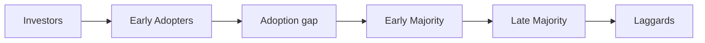

Notes from 2nd chapter of __The Product Book__.

# What product are we building?

# Why does the company exist?

[Start with Why](https://www.youtube.com/watch?v=qp0HIF3SfI4&ab_channel=TED)
There's a book as well.

## _Why_ is guiding light

If the product is told as a story, __why__ is the theme. 

What is the story about?

__Mission Statement__

__why->how->what__

Start with raison d'etre, then figure out how it would be achieved, and finally __what__ to build.

#NB The order of __how__ and __what__ in this context is different than when thinking aobut requirements and implementation details.

### Apple examples:
* If starting with 'what :“We make great computers. They’re user-friendly, beautifully designed, and
easy to use. Want to buy one?” That’s fine, but it sounds pretty generic.
Many other PC manufacturers even make the same claim!

* if starting with 'why': “With
everything we do, we aim to challenge the status quo. We aim to think
differently. Our products are user-friendly, beautifully designed, and easy
to use. We just happen to make great computers. Want to buy one?

The 2nd one is supposedly more useful to guide product decisions.

# Bad Missions
## Revenue goal

Company would fail, cause it's backwards. You bring value and then get the revenue. Goal is to make customer awesome.

## Solution looking for a problem
 
 Can imagine why.

## No mission statement

Can be moderately successful, but may be hard to grow, as it's not clear what the product line is about. 

Thus subsequent products may feel disjointed, may start to solve too many different problems, etc.

__Figure out at least a common implicit/latent value proposition.__

Misfit example w/ wearables.

# [[seed.Product Management.Target Customers]] and  [[seed.Product Management.Personas]]

# Personas

Must represent real target market!!
## roman Pichler Persona Template

When writing, write only stuff that's relevant to your product! Delete rest
* Priorities, related to your product/area of expertise
* Pain points
* Imagine customer journey, how do you beat the status quo?

## Demographics

Overused, use demographic information only if relevant, else use goals/targets/objectives/constraints/feelings/etc.

Focusing on common pain points/objectives/desires segment better than demographics!

Try to make it a real persona.

## Multiple Perosonas

### Examples:
* 2-sided marketplaces. 
* Buyer and customer are different

# Adopter Curve

Must jump over adoption gap before mass maarket adoption

# Make Realistic Personas, get under their skin

#  Use Cases

How personas would use the thing?

# Enterprise vs Consumers

# How to measure if product is good

Task success, [[seed.Product Management.Product Metrics]]

# Vanity Metrics vs Actionable

 Some metrics can be Investor BS.

## Measuring Metrics
## Net Promoter score,e tc

## What's the rest of product portfolio

## Roadmap

## Competition and Climate

# Company Context
5C:
* Company
* Customers
* Collaborators
* Competitors
* Culture/Climate - macroeconomics or cultural things that are current

